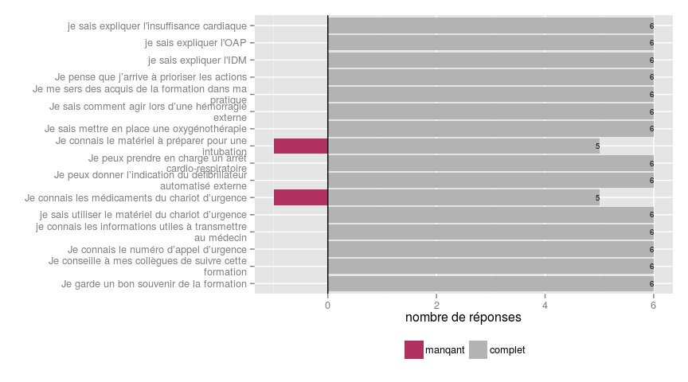
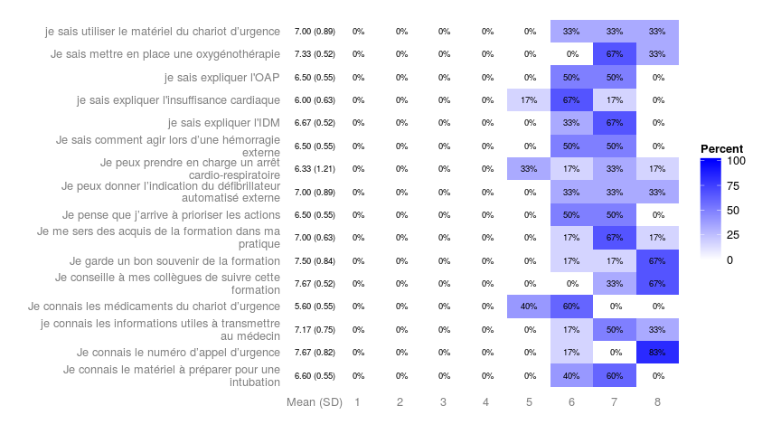
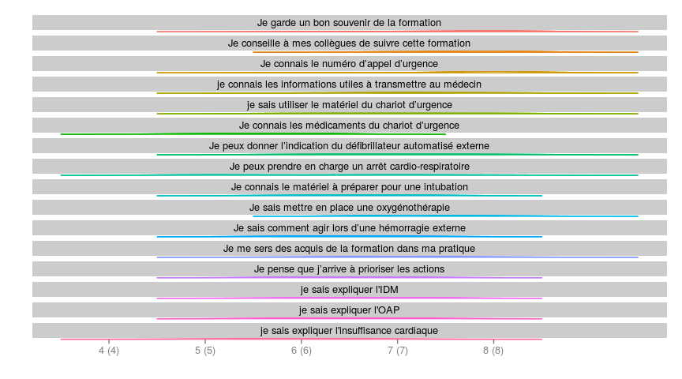

# Questionnaire à distanc
JcB  
09/11/2014  

L'analyse suivante exploite la librairie __Likert__. On trouve une aide à son utilisation aux adresses suivantes:

- CESU/cours stat/Likert (+++)
- voir aussi la package __HH__ (pages 71 à 91)
- https://github.com/jbryer/likert/blob/master/demo/likert.R


```r
library("likert")
```

```
Loading required package: ggplot2
Loading required package: xtable
```

```r
library(reshape)
```

```
Loading required package: plyr

Attaching package: 'reshape'

The following objects are masked from 'package:plyr':

    rename, round_any
```

```r
file <- "data/qestionnaire_distance.csv"
d <- read.csv(file)

# on fait une copie sans a colonne 1 qui ne sert à rien
d2 <- d[,-1]

likert(d2, nlevels = 8)
```

```
   Item 1 2 3 4        5        6        7        8
1    q1 0 0 0 0  0.00000 16.66667 16.66667 66.66667
2    q2 0 0 0 0  0.00000  0.00000 33.33333 66.66667
3    q3 0 0 0 0  0.00000 16.66667  0.00000 83.33333
4    q4 0 0 0 0  0.00000 16.66667 50.00000 33.33333
5    q5 0 0 0 0  0.00000 33.33333 33.33333 33.33333
6    q6 0 0 0 0 40.00000 60.00000  0.00000  0.00000
7    q7 0 0 0 0  0.00000 33.33333 33.33333 33.33333
8    q8 0 0 0 0 33.33333 16.66667 33.33333 16.66667
9    q9 0 0 0 0  0.00000 40.00000 60.00000  0.00000
10  q10 0 0 0 0  0.00000  0.00000 66.66667 33.33333
11  q11 0 0 0 0  0.00000 50.00000 50.00000  0.00000
12  q12 0 0 0 0  0.00000 16.66667 66.66667 16.66667
13  q13 0 0 0 0  0.00000 50.00000 50.00000  0.00000
14  q14 0 0 0 0  0.00000 33.33333 66.66667  0.00000
15  q15 0 0 0 0  0.00000 50.00000 50.00000  0.00000
16  q16 0 0 0 0 16.66667 66.66667 16.66667  0.00000
```

```r
# on fait une copie de d2 et on modifiel'intitulé de colonnes pour qu'il corresponde à celui des questions
d3 <- d2

d3 <- rename(d3, c(
    q1="Je garde un bon souvenir de la formation", 
    q2="Je conseille à mes collègues de suivre cette formation", 
    q3="Je connais le numéro d’appel d’urgence", 
    q4="je connais les informations utiles à transmettre au médecin", 
    q5="je sais utiliser le matériel du chariot d’urgence", 
    q6="Je connais les médicaments du chariot d’urgence", 
    q7="Je peux donner l’indication du défibrillateur automatisé externe", 
    q8="Je peux prendre en charge un arrêt cardio-respiratoire", 
    q9="Je connais le matériel à préparer pour une intubation", 
    q10="Je sais mettre en place une oxygénothérapie", 
    q11="Je sais comment agir lors d’une hémorragie externe", 
    q12="Je me sers des acquis de la formation dans ma pratique", 
    q13="Je pense que j’arrive à prioriser les actions", 
    q14="je sais expliquer l'IDM", 
    q15="je sais expliquer l'OAP", 
    q16="je sais expliquer l'insuffisance cardiaque"))

likert(d3, nlevels = 8)
```

```
                                                               Item 1 2 3
1                          Je garde un bon souvenir de la formation 0 0 0
2            Je conseille à mes collègues de suivre cette formation 0 0 0
3                            Je connais le numéro d’appel d’urgence 0 0 0
4       je connais les informations utiles à transmettre au médecin 0 0 0
5                 je sais utiliser le matériel du chariot d’urgence 0 0 0
6                   Je connais les médicaments du chariot d’urgence 0 0 0
7  Je peux donner l’indication du défibrillateur automatisé externe 0 0 0
8            Je peux prendre en charge un arrêt cardio-respiratoire 0 0 0
9             Je connais le matériel à préparer pour une intubation 0 0 0
10                      Je sais mettre en place une oxygénothérapie 0 0 0
11               Je sais comment agir lors d’une hémorragie externe 0 0 0
12           Je me sers des acquis de la formation dans ma pratique 0 0 0
13                    Je pense que j’arrive à prioriser les actions 0 0 0
14                                          je sais expliquer l'IDM 0 0 0
15                                          je sais expliquer l'OAP 0 0 0
16                       je sais expliquer l'insuffisance cardiaque 0 0 0
   4        5        6        7        8
1  0  0.00000 16.66667 16.66667 66.66667
2  0  0.00000  0.00000 33.33333 66.66667
3  0  0.00000 16.66667  0.00000 83.33333
4  0  0.00000 16.66667 50.00000 33.33333
5  0  0.00000 33.33333 33.33333 33.33333
6  0 40.00000 60.00000  0.00000  0.00000
7  0  0.00000 33.33333 33.33333 33.33333
8  0 33.33333 16.66667 33.33333 16.66667
9  0  0.00000 40.00000 60.00000  0.00000
10 0  0.00000  0.00000 66.66667 33.33333
11 0  0.00000 50.00000 50.00000  0.00000
12 0  0.00000 16.66667 66.66667 16.66667
13 0  0.00000 50.00000 50.00000  0.00000
14 0  0.00000 33.33333 66.66667  0.00000
15 0  0.00000 50.00000 50.00000  0.00000
16 0 16.66667 66.66667 16.66667  0.00000
```

```r
# plot(likert(d3, nlevels = 8))
l <- likert(d3, nlevels = 8)
summary(l)
```

```
                                                               Item low
3                            Je connais le numéro d’appel d’urgence   0
4       je connais les informations utiles à transmettre au médecin   0
6                   Je connais les médicaments du chariot d’urgence   0
9             Je connais le matériel à préparer pour une intubation   0
11               Je sais comment agir lors d’une hémorragie externe   0
13                    Je pense que j’arrive à prioriser les actions   0
15                                          je sais expliquer l'OAP   0
1                          Je garde un bon souvenir de la formation   0
2            Je conseille à mes collègues de suivre cette formation   0
5                 je sais utiliser le matériel du chariot d’urgence   0
7  Je peux donner l’indication du défibrillateur automatisé externe   0
8            Je peux prendre en charge un arrêt cardio-respiratoire   0
10                      Je sais mettre en place une oxygénothérapie   0
12           Je me sers des acquis de la formation dans ma pratique   0
14                                          je sais expliquer l'IDM   0
16                       je sais expliquer l'insuffisance cardiaque   0
   neutral high     mean        sd
3        0  100 7.666667 0.8164966
4        0  100 7.166667 0.7527727
6        0  100 5.600000 0.5477226
9        0  100 6.600000 0.5477226
11       0  100 6.500000 0.5477226
13       0  100 6.500000 0.5477226
15       0  100 6.500000 0.5477226
1        0  100 7.500000 0.8366600
2        0  100 7.666667 0.5163978
5        0  100 7.000000 0.8944272
7        0  100 7.000000 0.8944272
8        0  100 6.333333 1.2110601
10       0  100 7.333333 0.5163978
12       0  100 7.000000 0.6324555
14       0  100 6.666667 0.5163978
16       0  100 6.000000 0.6324555
```

```r
likert.histogram.plot(l, label.completed = "complet", label.missing = "manqant", xlab="nombre de réponses")
```

 

```r
likert.heat.plot(l, text.size = 2.5)
```

 

```r
likert.density.plot(l)
```

 

Rotation image
--------------

#### utilisation de heat plot


